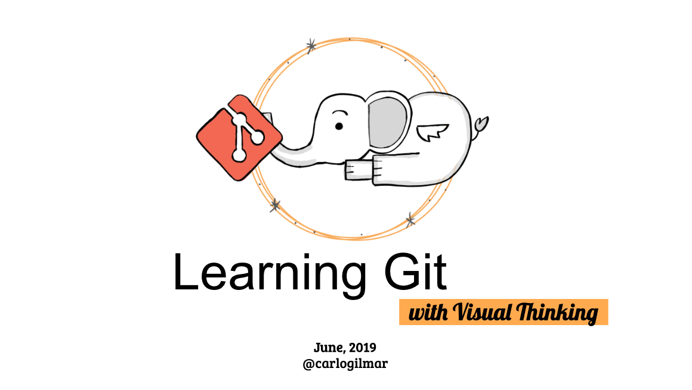

# Git Course with Visual Thinking

[Slides](https://drive.google.com/drive/folders/1mOsxll7Kuyx7oQ-oxfMV0kgplu-Ge00X?usp=sharing) 

### Goals
  - Audience
  - Goals step by step

### Summary

Introduction
- Audience for this
- What is a version control? (VCS what it is, benefits, why git, key features)
- What git can do? (repositories, versions, artifacts, comparison, collaboration, accountability)
- Git history
- Git study cases
- Git for your organization
- What is the terminal?
- Why command line?
- Text editor
- File system navigation using the terminal
- Manipulating files and folders

Git Basics

1. Setup and installation
- Installing git (linux, macos, windows)
- Git Help
- Configuring git

2. Setting up a git repository
- Git areas, how git works?
- Initializing an empty repository
- Adding git to an existing repository
- Cloning an existing repository

3. Basic workflow
- Basic workflow (add, commit)
- Tracking files
- Viewing changes
- Committing your changes
- Setup git ignore files
- Browsing project history
- Commit History
- Ignoring files

4. Remote repositories
5. Branching 
6. Workflows
- GitHub
- BitBucket

7. Submodules
8. Rebasing
9. Stashing
10. Hooks
11. Bisect

### Releases

### Resources

- [@frontendmasters Git in depth](https://frontendmasters.com/courses/git-in-depth/)
- [@gittraining Git training](http://git.training/courses/)
- [Practical Git](https://egghead.io/courses/practical-git-for-everyday-professional-use)
- [Git and GitHub masterclass](https://subscription.packtpub.com/video/networking_and_servers/9781789137293)
- [Git Complete](https://subscription.packtpub.com/video/application_development/9781787123618)
- [Conquering git](https://subscription.packtpub.com/video/application_development/9781788833042)
- [Git Essentials](https://subscription.packtpub.com/book/application_development/9781787120723)
