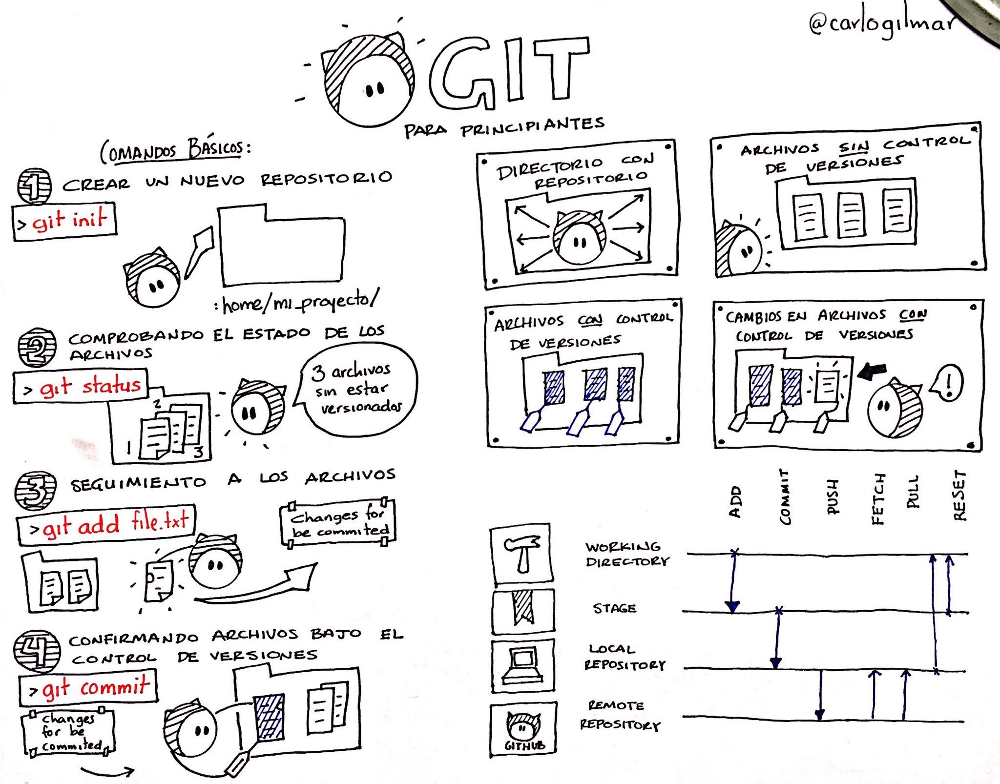

## Curso de Git

> OBJETIVO: Conocer los elementos esenciales del control de versiones mediante el uso de git para proyectos de software de tal forma que los asistentes cuenten con los conocimientos suficientes para comenzar a usarlo en su día a día.

*Dirigido a personas con conocimiento básico de git.*

### Temario

#### 1. Tooling para desarrollo de software

- Editor de texto
- Shell de *Unix y tipos de shell
- Comandos básicos
- Multiplexor de ventanas
- Instalación y configuración de Git
- Git GUI
- Plugins para editores de texto ( vim, visual studio, y sublime text )

#### 2. Nociones básicas

- Creación de un repositorio
- Áreas de Git
- DAG y Git Objects
- Stage Area ( add )
- Local repository ( commit )
- Log de git

#### 3. Comandos prácticos

- git status
- git diff
- git checkout
- git stash
- git log
- git reset
- Reescribir último commit
- Ignorar archivos

#### 4. Manipulación de un repositorio

- Situarse en un commit previo
- Búsquedas sobre el log
- git show
- git blame

#### 5. Repositorios Remotos: GitHub

- Creación de cuenta de GitHub
- Áreas de git
- Sincronizar un repositorio local en un repositorio remoto
- git push
- git pull
- Clonar un repositorio

#### 6. Repositorios Remotos Open Source

- Gogs
- Gitea

#### 7. Branching

- Crear un branch
- Operaciones sobre un branch
- git merge
- git rebase
- Abortar operaciones

#### 8. Git Tooling

- gitk
- Gourse
- git stats

#### 9. Git Workflows

- Single flow
- GitHub Workflow
- Feature branch
- Git flow

#### 10. Reestructuración de un repositorio

- git rebase

#### 11. Automatización

- git bisect
- git hooks
