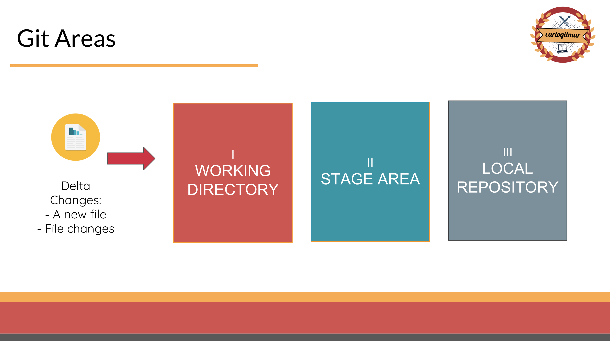
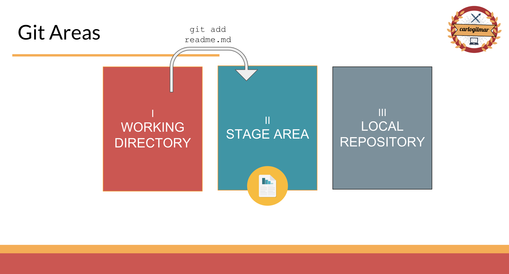
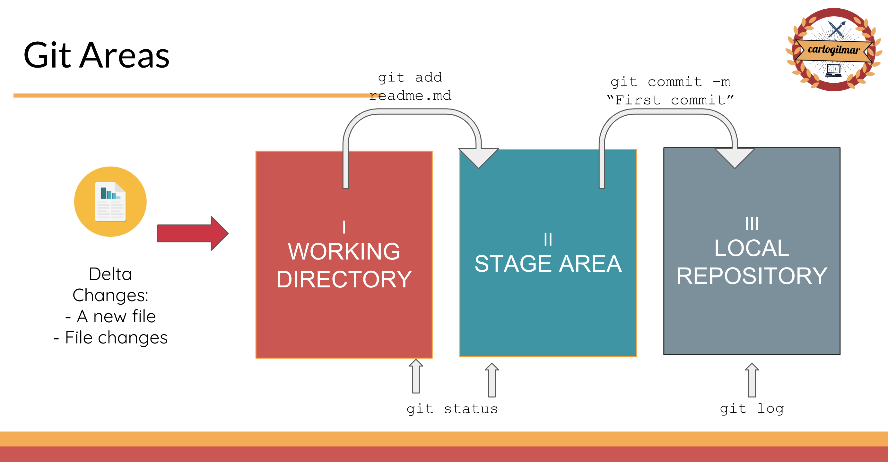

# Nociones básicas

Sobre git:

- Creado por Linus Torvalds en 2005
- Es un sistema de archivos
- Internamente implementa un Grafo Acíclico Dirigido DAG
- Es un sistema de control de versiones distribuido

[Git](https://www.youtube.com/watch?v=jHzbLNVhv-c )
[Linux](https://www.youtube.com/watch?v=5iFnzr73XXk&t=4686s)

### Creación de un repositorio

```
$ mkdir my_project

$ git init
Inicializado repositorio Git vacío en /Users/carlogilmar/Desktop/prueba/.git/
```

### DAG y Git Objects

```
$ tree -L 3 .git
.git
├── HEAD
├── config
├── description
├── hooks
│   ├── applypatch-msg.sample
│   ├── commit-msg.sample
│   ├── fsmonitor-watchman.sample
│   ├── post-update.sample
│   ├── pre-applypatch.sample
│   ├── pre-commit.sample
│   ├── pre-push.sample
│   ├── pre-rebase.sample
│   ├── pre-receive.sample
│   ├── prepare-commit-msg.sample
│   └── update.sample
├── info
│   └── exclude
├── objects
│   ├── info
│   └── pack
└── refs
    ├── heads
    └── tags

8 directories, 15 files
```

### Áreas de Git

1. Working Directory
2. Stage Area
3. Local Repository
4. Remote Repository



```
$ git status
```

### Working Directory


Cualquier archivo creado dentro del repositorio estará en el *working directory*

```
$ touch readme.md
$ git status
En la rama master

No hay commits todavía

Archivos sin seguimiento:
  (usa "git add <archivo>..." para incluirlo a lo que se será confirmado)

        readme.md

no hay nada agregado al commit pero hay archivos sin seguimiento presentes (usa "git add" para hacerles seguimiento)
```

El branch/rama *master* es el nombre de la línea temporal por defecto de cualquier repositorio de git.

### Stage Area ( add )



```
$ git add readme.md
En la rama master

No hay commits todavía

Cambios a ser confirmados:
  (usa "git rm --cached <archivo>..." para sacar del área de stage)

        nuevo archivo:  readme.md
```

### Local repository ( commit )


```
$ git commit -m "Agregando archivo readme.md"
[master (commit-raíz) 7178862] Agregando archivo readme.md
 1 file changed, 0 insertions(+), 0 deletions(-)
 create mode 100644 readme.md

$ git status
En la rama master
nada para hacer commit, el árbol de trabajo está limpio
```

### Log de git



```
$ git log
commit 71788626f945c88a1c9ad00b28bc95d936bee63e (HEAD -> master)
Author: carlogilmar <carlogilmar12@gmail.com>
Date:   Fri Feb 22 23:12:26 2019 -0600

    Agregando archivo readme.md
```


